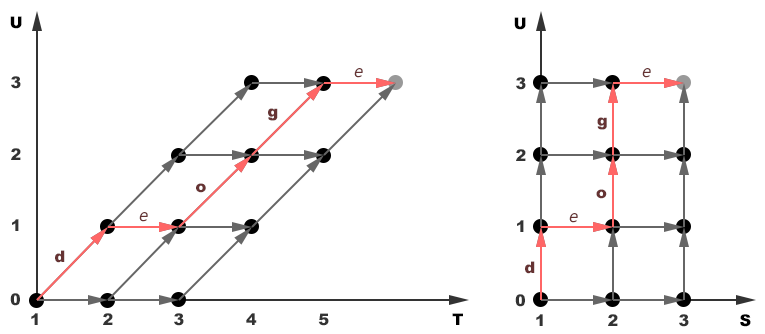
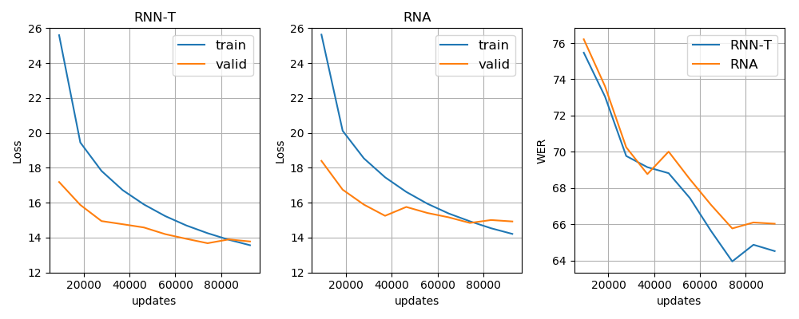

# Recurrent Neural Aligner

Recurrent Neural Aligner (RNA) is a restricted version of RNN-Transducer loss (RNN-T). It assumes that the length of input sequence is equal to or greater than the length of target sequence ([Sak, et al., 2017](https://www.isca-speech.org/archive/Interspeech_2017/pdfs/1705.PDF); [Dong, et al., 2018](https://arxiv.org/abs/1806.06342)).

In this repository you can find a reference implementation of RNA loss in python, as well as a fast GPU version on CUDA. In order to apply the same efficient procedure from [warp_rnnt](https://github.com/1ytic/warp-rnnt), the alphas/betas arrays are represented as shown below. Because RNA loss assumes that a model produces only one output at each input step, we can reduce the T dimension to S=T-U+2.




## Convergence

In the figure below shows a sanity check of the implementation for the speech recognition task with a small dataset. The decoding procedure was the same for both models. As you can see RNN-T loss more stable in this case.



If you have a successful example of using RNA loss or if you find errors in this implementation, please make an issue for this repository.

## Install
Currently, there is only a binding for PyTorch 1.0 and higher.

```bash
pip install warp_rna
```

## Test
There is a unittest in pytorch_binding/warp_rna which includes tests for arguments and outputs as well.

```bash
cd ..
python -m warp_rna.test
```
